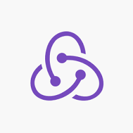

## Hi 👋 I am Rashid Makki! 

I am a software developer with 1.5 years of full-stack development experience. Skilled in problem-solving and passionate about innovation. Seeking a challenging position to contribute technical expertise and collaborate effectively in a dynamic software development team. Proficient in Java, HTML, CSS, JavaScript, React, NodeJs, SQL. Strong communication and teamwork abilities. I am looking for full-stack development role.

- 👨🏽‍💻 Currently working, learning and growing my skillset in Backend Development, competitive coding, data structures and algorithms.
- 🤝 Open for collaborations in fullstack development.
- 😊 Willing to contribute in opensource development projects.
- 👍 Looking for opportunities to join as an intern/full time in  fullstack development. 
- 🌐 Visit my [porfolio website](https://rashidmakki.netlify.app/) for complete background and contact.

**Languages and Tools:**  

<code></code>
<code></code>
<code></code>
<code></code>
<code></code>

### Hi there, I'm [Rashid!](https://rashidmakki.netlify.app/) 👋

<!--
**rashidmakki/rashidmakki** is a ✨ _special_ ✨ repository because its `README.md` (this file) appears on your GitHub profile.

Here are some ideas to get you started:

- 🔭 I’m currently working on ...
- 🌱 I’m currently learning ...
- 👯 I’m looking to collaborate on ...
- 🤔 I’m looking for help with ...
- 💬 Ask me about ...
- 📫 How to reach me: ...
- 😄 Pronouns: ...
- ⚡ Fun fact: ...
-->
